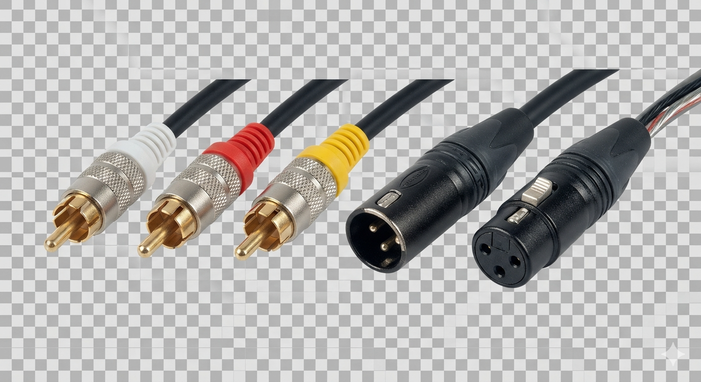

Link to this page:


# 1. Who should use this

Developers who 

- want to communicate without the approval of third parties,
- who believe that a democracy only exists as much as its people are able to,
- who don't want to perpetuate a consumer / provider model,
- who remember when we thought the internet would break down borders,
- or who simply value low latency, legibility, and future proofed interoperability,

# 2. Why

Many great decentralized systems have been made, that don't talk to each other.   



You recognize all of these because they don't do much.    They don't care what's sent over them -- analog audio, SPDIF digital audio, video, DMX lighting.  That's a standard primitive not an application.  The decentralization community needs modular interoperable standards and more UNIX philosophy, not more applications or complex protocols that can't be piped together -- like HTTP for P2P.

Massive organizations work together to control information flows, and the structural censorship of home routers and mobile connections continue to get worse at P2P communication, while the decentralized community doesn't even agree how to say "hi" to each other at a protocol level.  We need a common ground, like English for the wire, with no central authority -- an envelope or design pattern moreso than a framework.  Think of an RCA plug for the internet. A small set of future proofed decisions that anyone can easily implement and expand on. Just like IP, but it's time to bring the common layer a bit higher for modern times, because the bottlenecks have moved.  We can now generate a gigabit per second of base64 wrapped in JSON and sent over UDP with a 10 year old CPU, and modern languages have robust JSON libraries that serialize directly to/from type safe variables.  We can build most things in a human/LLM centric way now, not computer centric.  You're the bottleneck now, not the hardware.  This is a new era of computing.  

# 3. the (un)protocol

A UTF-8 encoded JSON array of zero or more objects each containing one key/value, with the value being a JSON object (an LCDP "message") sent over a message oriented protocol, such as UDP or UDP is unavailable, a websocket.

Ignore unrecognized messages and fields.  Expand by adding messages or fields, but don't break the meaning of existing ones.

https://datatracker.ietf.org/doc/html/draft-pearson-lcdp

## Examples 

(you don't have to use any of these)


```json
[{"ChatMessage":{"message":"hi"}}]
```
```json
[{"PleaseSendContent":{
"id":"8f434346648f6b96df89dda901c5176b10a6d83961dd3c1ac88b59b2dc327aa4",
"length":4096,
"offset":0 }},
"AlwaysReturned":["cookie","abc123"]}]
```
```json
[{"PleaseSendPeers":{}},
"AlwaysReturned":["cookie","abc123"]}]
```
```json
[{"Peers":{"peers":["159.69.54.127:24254"]}}]
```
```json
[{ "EncryptedMessages": {
"base64": "LCDP encrypted in base64",
"noise_params": "Noise_IK_25519_AESGCM_SHA256"
} }]
```
```json
[{"FastEncryptedMessages": { "ciphertext": "some base64..", "nonce":"xyz",  "sender": "an ed25519",}]
```
```json
[{"AudioFrame":{ "sampleRate": 48000, "channels": 1, "format": "'f32' or 'opus' have been seen so far", "data": "some base64" }
]
```
## why this way

### UNIX philosophy.  

- Modularity: simple parts connected by clean interfaces.

- Clarity Over Cleverness: clean and easy to maintain rather than overly complex or obscure 

- Composition: Design programs to be connected to other programs.

- Separation: Separate policy from mechanism; separate interfaces from engines.

- Simplicity: Design for simplicity; add complexity only where you must.

- Transparency: Design for visibility to make inspection and debugging easier.

- Robustness: Robustness is the child of transparency and simplicity.

- Rule of Representation: Fold knowledge into data so program logic can be stupid and robust. 

- Rule of Least Surprise: In interface design, always do the least surprising thing.

- Rule of Economy: Programmer time is expensive; conserve it in preference to machine time.

- Rule of Generation: Avoid hand-hacking; write programs to write programs when you can. [ a JSON wire protocol is very LLM friendly ]

- Rule of Optimization: Prototype before polishing. Get it working before you optimize it. 

- Rule of Diversity: Distrust all claims for “one true way”.

- Rule of Extensibility: Design for the future, because it will be here sooner than you think. [ JSON and UDP are stable ] 

- Do One Thing and Do It Well: focus on a single, specific task rather than trying to be a massive monolithic application.

- Use universal interfaces: like plain text [ which JSON is ]

### why these specifics

- An array of objects with one key with a value that is an object so that your main loop or deserializer stays simple, for example:

```js
for (let m of packet) {
  let type = Object.keys(m)[0];
  handlers[type]?.(m[type]);
}
```

- ignore unknown message types, so we know how to expand without breaking existing things.  

- perpetual compatibility by extension or obsolescence, not versioning. Like human language - you don't upgrade English to v2. Old node sees `{"message":"hi","lang":"en"}`, ignores `lang`, still shows `hi`.  

- JSON namespace is virtually unlimited, just add fields or new message types to extend, not clobber existing meaning.


# 4. non-technical (optional reading)

## summary

Lowest Common Denominator Protocol (LCDP) tracking page

LCDP is a simple, interoperable, expansible, message oriented peer to peer protocol, allowing participants to keep only as much state about peers as     they prefer, implementing only the message types of interest, with minimal latency, and perpetual compatibility by extension not versioning, Nothing to patent, copyright, gatekeep, version, or trademark.  Uncorruptable.

The [RCA connector](https://en.wikipedia.org/wiki/RCA_connector) for the internet.   Send anything over it.  The plug doesn't care.

You're still left with one of the two hard problems of computer science -- naming things.

Matrix https://matrix.to/#/!8B6Z68iF0FKeYq6-EYu8PGZ0fOKEgUapthEfpMAyXtw?via=matrix.org
Telegram https://t.me/lowest_common_denominator

## inspired by 

- https://farcaster.xyz/vitalik.eth/0xd6b8e141  
- https://medium.com/@webseanhickey/the-evolution-of-a-software-engineer-db854689243
- https://cscie2x.dce.harvard.edu/hw/ch01s06.html Unix Philosophy
- https://m.youtube.com/shorts/98dQH9tKPEA
- https://knightcolumbia.org/content/protocols-not-platforms-a-technological-approach-to-free-speech
- https://www.rfc-editor.org/rfc/rfc9518.html
- "Simple: no additional complexity should be present in the base protocol than can reasonably be offloaded into middleware" -- Gavin Wood

## elaborative essays

- [quick-start.md](quick-start.md)
- [english_for_the_wire.md](english_for_the_wire.md)
- [why-messages-not-connections.md](why-messages-not-connections.md)
- [agents_love_it.md](agents_love_it.md)
- [the_hidden_front_line_of_the_battle_for_free_speech.md](the_hidden_front_line_of_the_battle_for_free_speech.md)
- [lcdp_description_for_libp2p_users.md](lcdp_description_for_libp2p_users.md)
- [how_lcdp_contrasts_to_nostr.md](how_lcdp_contrasts_to_nostr.md)
- [how_lcdp_contrasts_to_iroh.md](how_lcdp_contrasts_to_iroh.md)
- [how_lcdp_contrasts_to_the_p2p_landscape.md](how_lcdp_contrasts_to_the_p2p_landscape.md) (SSB, Hypercore/DAT, Cabal, Earthstar, Willow, Holochain, P2Panda, GNUnet, NextGraph, Qaul, Pijul, libp2p, Veilid, Briar)

## fun things to try

- [Make your own p2p app with AI and 0 programming experience.](make_your_own_p2p_app_with_AI_and_no_programming_experience.md)
- Claude, look at pong.html and make a Atari 2600 Combat
- Claude, look at dashboard.html and make IPv4 scarcity based voting system.
- Claude, look at chat.html and make a proof-of-burn ed25519 key signer 


# 4. as seen in the wild  (suggested reading)
## message types 
### SHOULD implement
#### anti-spoof
```JSON
{"PleaseAlwaysReturnThisMessage":["cookie","String"]
{"AlwaysReturned":               ["cookie","String"]
```
Piggyback AlwaysReturned (and your own PleaseAlwaysReturnThisMessage) onto replies you are already sending for other reasons.  Never send them as a standalone reply -- that creates a ping-pong loop with no useful content.   Currently, this is only used so no one can fake ("spoof") their source IP to use a node to spam ("flood") someone else.   Messages recieved without the correct AlwaysReturned should only be sent responses that, on average, are no more than twice the size of such messages received.  ( https://en.wikipedia.org/wiki/IP_address_spoofing )        .  Or any other means you can know your response isn't multiplying traffic more than 2.5x to an unwilling recipient.    The cookie should not be predictable or reused with other peers or the point is defeated.  You could use a hash of their address and a secret to not need to save a random per peer.
### MAY implement

see the https://github.com/kermit4/LCDP/wiki and add your own.

## known implementations
### of the node
- In Rust https://github.com/kermit4/cjp2p-rust/ (by far the most developed and intelligent, so also not the simplest example to read)
- https://github.com/kermit4/cjp2p-ruby (most protocol features, not very intelligent, but much much easier to read than the more developed Rust version, even if you know Rust and not Ruby)
- https://github.com/kermit4/cjp2p-bash (most protocol features, but not intelligent, slow transfers, easy to read if you know BASH but not Rust)
- https://github.com/kermit4/cjp2p-haskell (very few features)
- There's rumors of a Go version but I haven't seen the code
### Web based interfaces to the node
- https://oneplusone.bzz.link/ - has a blank to input a different websocket URL if you dont have one running at localhost
- lots more at http://localhost:24255/latest/e13a614dff88de239a986bea20ca129c3dc77bb727fac18f2f092eed27cfb3fb/   (also at https://github.com/kermit4/LCDP_web_apps )


## likely to be running nodes
- UDP 148.71.89.128:24254
- UDP 159.69.54.127:24254

# 5. development hints

` echo -n '[{"PleaseSendPeers":{}}]' |nc -u localhost -p 12321 24254`

 `tcpdump -As 9999 -i any port 24254`

You could make something useful by implimenting no more than WhereAreThey and ChatMessage, or just as examples, or only PleaseSenContent, or just WhereAreThey and AudioFrame, or only PleaseReturnThisMessage, or some new type of your own. 


The protocol should sound more like people than computers.   Simple requests, share a lot, expect little, be tolerant -- you're talking to strangers using automation, not computers.  Prefer to leave decisions up to implementations.  It's a language for ordinary people using automation.  Everyone starts somewhere, keep it accessible to any programming skill level, with more advanced features optional (or not, it's up to you on your node and implementation).  Use long names for things, bandwidth is cheaper than explanations.

Pay attention to unhandled messages and consider implementing them. Make your own -- you don't have to wait for some official protocol update to add messages or fields, just don't crash if you receive some, post about it here or somewhere and check that no one else has used it.  The namespace is virtually unlimited.

